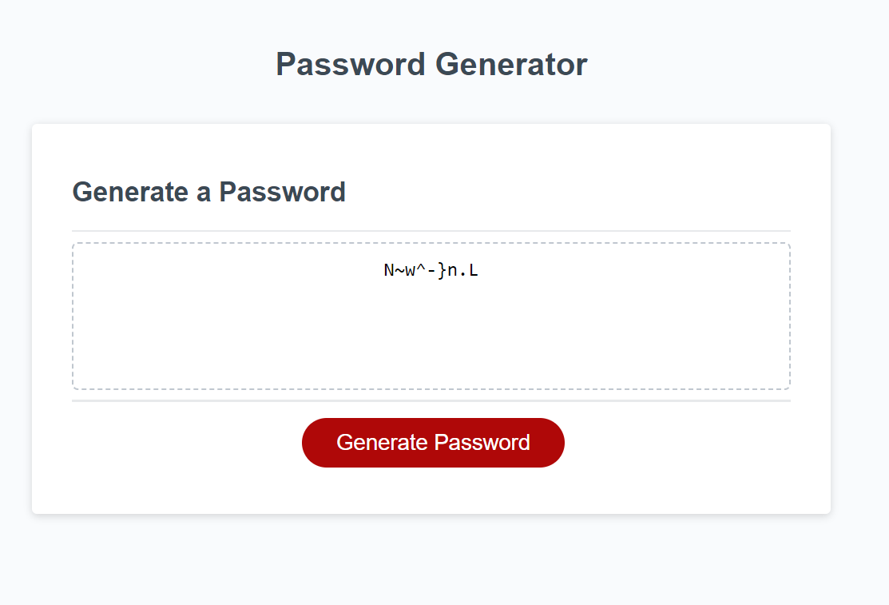

# Password Generator

I was given the HTML, CSS and a bit javascript code with the challenge that I needed to create a password generator
with a few conditions the user had to select.

## Features

- Generates a strong password

- Password is conditional on certain criteria the user selects in a series of prompts

- Several sanity checks

- Random password generation, incredibly unlikely to get the same two passwords demonstrated in this code snippet:
> password += possibleChars.charAt(Math.floor(Math.random() * possibleChars.length));

## Usage

1. Go to [this](https://yggdrasiljl.github.io/password-generator/) site

2. Click "Generate Password"

3. Put desired number in the prompt

4. go through the confirmations to create your password (The more you use, the stronger the password)

5. Copy password

## Screenshot

# Author

Jacob Lowther